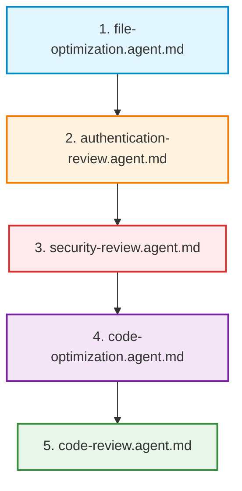

# Backend AI Agents

This directory contains specialized AI agent prompt and workflow specifications for the **Tawkeed Leave Management Portal** backend. These instruction files guide Antigravity or any LLM-powered coding assistant through systematic inspection, cleanup, optimization, authentication auditing, security auditing, and comprehensive code review.

---

## Purpose & Overview

The agents defined in this directory are purpose-built to evaluate and polish a production-oriented FastAPI backend without introducing regressions, breaking API contracts, or compromising existing security mechanisms.

Each agent operates with high rigor, demanding code inspection before proposal, evidence-based refactoring, test execution after modifications, and zero exposure of sensitive runtime configuration or credentials.

---

## Agent Roster

| Agent File | Specialization | Core Focus |
| :--- | :--- | :--- |
| `file-optimization.agent.md` | Repository Maintainer | Dead files, duplicate artifacts, repo cleanliness, git hygiene |
| `authentication-review.agent.md` | AppSec Specialist (Auth) | JWT lifecycle, Argon2 hashing, token versioning, lockout, RBAC |
| `security-review.agent.md` | Senior AppSec Auditor | IDOR, RBAC boundary, SQL injection, CORS, business rule bypass |
| `code-optimization.agent.md` | Performance & Quality Engineer | SQLAlchemy query efficiency, N+1 elimination, transactions, typing |
| `code-review.agent.md` | Senior Software Engineer | Full architecture, consistency, test coverage, submission readiness |
| `master-review.agent.md` | Lead Orchestrator | End-to-end coordinated execution of all review phases |

---

## Agent Execution Order

To ensure structured, safe, and non-conflicting improvements, agents should be executed in the following sequential order:

1. **`file-optimization.agent.md`**: Cleans up repository clutter, temporary artifacts, and verifies project layout before touching code logic.
2. **`authentication-review.agent.md`**: Audits and hardens identity, token issuance, password security, and role extraction at the gateway layer.
3. **`security-review.agent.md`**: Examines resource-level authorization (IDOR), team boundaries, leave self-approval prevention, input validation, and audit trail integrity.
4. **`code-optimization.agent.md`**: Refines database query patterns, transaction scopes, balance locking, and service layer ergonomics.
5. **`code-review.agent.md`**: Conducts the comprehensive final review, scores the project, validates test suites (>= 70% coverage target, current baseline ~93%), and produces the submission assessment.

> **Note:** `master-review.agent.md` orchestrates the complete end-to-end multi-phase workflow from initial reconnaissance to final readiness certification.

---

## Safety Rules & Guardrails

All agents operating in this repository must strictly adhere to these immutable rules:

1. **No Destructive Deletion Without Proof**: Never delete or move a file without inspecting references, imports, and Git tracking.
2. **No Secrets in Output or Logs**: Never read, print, log, or commit actual secret values, tokens, or contents from `.env`.
3. **No Production Database Changes**: Never target or modify production databases; use isolated test databases.
4. **No Migration Rewriting**: Preserve Alembic migration history. Do not alter existing migrations unless correcting an explicit schema bug.
5. **No Test Removal for Convenience**: Never delete or weaken test assertions merely to make the test suite pass.
6. **No Unnecessary Dependencies**: Avoid introducing third-party packages unless strictly necessary and justified.
7. **Maintain Backward Compatibility**: Do not change working API response structures or status codes unless fixing a verified defect.
8. **Always Run Tests After Changes**: Execute targeted unit/integration tests after localized edits and full `pytest` after phase completions.
9. **Never Claim Verification Without Execution**: Only report test passes, lint cleanups, or coverage percentages that have been explicitly measured.

---

## Project Context Reference

- **Framework**: FastAPI (Python 3.12)
- **Database & ORM**: PostgreSQL, SQLAlchemy 2.0 (declarative mapped models), Alembic
- **Auth & Cryptography**: JWT tokens (`pyjwt`), Argon2 password hashing (`pwdlib`)
- **Validation**: Pydantic v2 / `pydantic-settings`
- **Testing & Tooling**: `pytest`, `pytest-cov`, `pytest-asyncio`, `ruff`
- **Roles**: `ADMIN`, `MANAGER`, `EMPLOYEE`
- **Core Business Invariants**:
  - Leave calculations exclude weekends (Saturday & Sunday) and public holidays.
  - Leave cannot start in the past; end date cannot precede start date.
  - Pending/approved requests cannot overlap for the same employee.
  - Balance lifecycle: Request creates `reserved_days`; Approval converts to `used_days`; Rejection/Cancellation restores balance.
  - Managers can only approve/reject direct team requests and cannot approve their own leaves.
  - Audit logs are mandatory for all state-changing actions.
